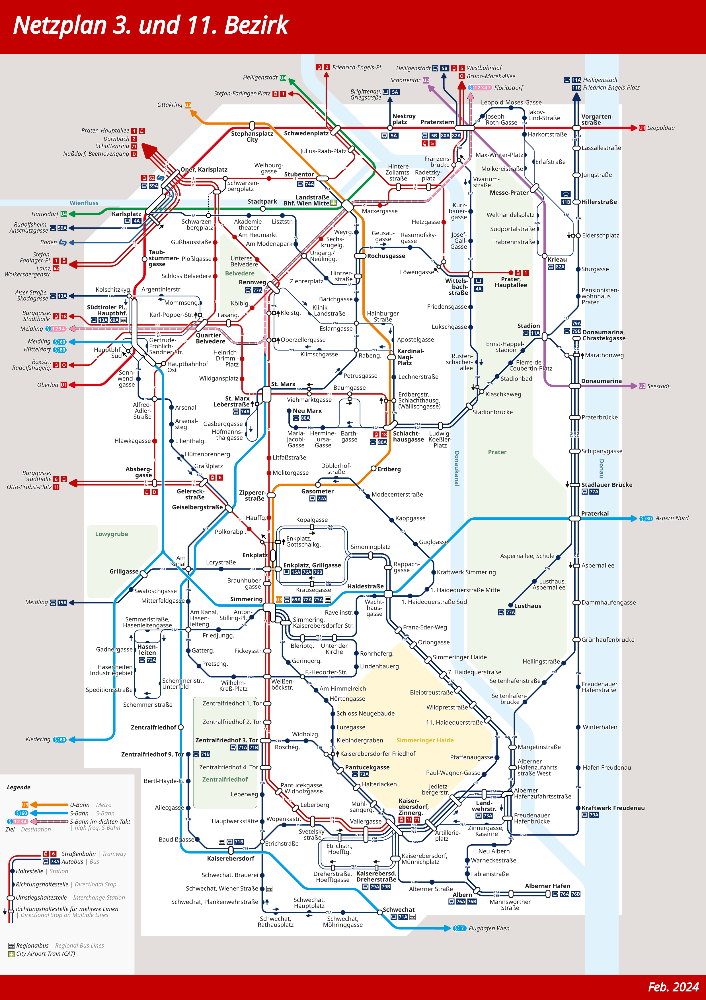

# Plan Landstraße-Simmering

Hierbei handelt es sich um einen erstellten Netzplan für die Landstraße und Simmering, der 3. beziehungsweise 11. Bezirk von Wien.

Dabei sind alle Linien im Bezirk, sowie darüber hinausgehend relevante Verbindungen eingezeichnet.

## Links zur Web-View

### Aktueller Plan (Stand 01. März 2024)
 * [PNG](https://raw.githubusercontent.com/T-DogCodes/plans-3_11_Landstrasse_Simmering/main/v24.02/Plan_3_11_Landstraße_Simmering.1200DPI.V24.02.2.png)
 * [PDF](https://raw.githubusercontent.com/T-DogCodes/plans-3_11_Landstrasse_Simmering/main/v24.02/Plan_3_11_Landstraße_Simmering.V24.02.2.pdf)

### Nächster Plan (Stand 02. April 2024)
 * [PNG](https://raw.githubusercontent.com/T-DogCodes/plans-3_11_Landstrasse_Simmering/main/v24.04/Plan_3_11_Landstraße_Simmering.1200DPI.V24.04.png)
 * [PDF](https://raw.githubusercontent.com/T-DogCodes/plans-3_11_Landstrasse_Simmering/main/v24.04/Plan_3_11_Landstraße_Simmering.V24.04.pdf)

## Andere Pläne:
 * [2. und 20. Bezirk](https://github.com/T-DogCodes/plans-2_20_Leopldstadt_Brigittenau)

## Vorschaubild

